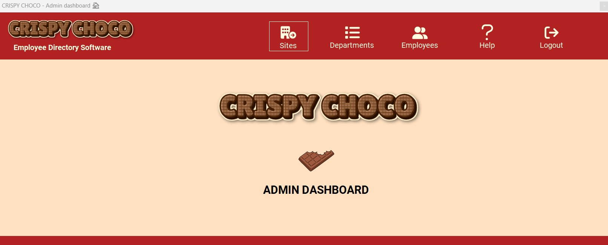

# Crispy Choco 🍫 

Dans le cadre de la formation de développeur informatique que je réalise actuellement au CESI de Bordeaux, j'ai réalisé une application de type client lourd relative à une entreprise fictive nommée Crispy Choco, un industriel américain spécialisé dans la fabrication de tablettes de chocolat. L'application permet aux salariés de l'entreprise de retrouver les coordonnées d'un collaborateur et comporte également un espace administrateur.

## Langages

- C# pour du Windows Forms (utilisation du framework .NET) et SQL

## Outils

- **IDE:** Visual Studio (utilisation des packages Fontawesome.Sharp et System.Data.SQLClient)
- **SGBD**: SQL Server Express
- **Gestion de base de données**: SQL Server Management Studio
- **Gestion de version**: Git

 &nbsp;&nbsp;&nbsp;&nbsp;&nbsp;&nbsp;

## Fonctionnalités

- **Accès visiteur:** rechercher un collaborateur selon trois critères: nom de famille, service ou site, consulter sa fiche salarié.
- **Accès administrateur**: login, CRUD portant sur les salariés, les services et les sites, recherche d'un salarié en fonction de son nom de famille.

## Screenshot

